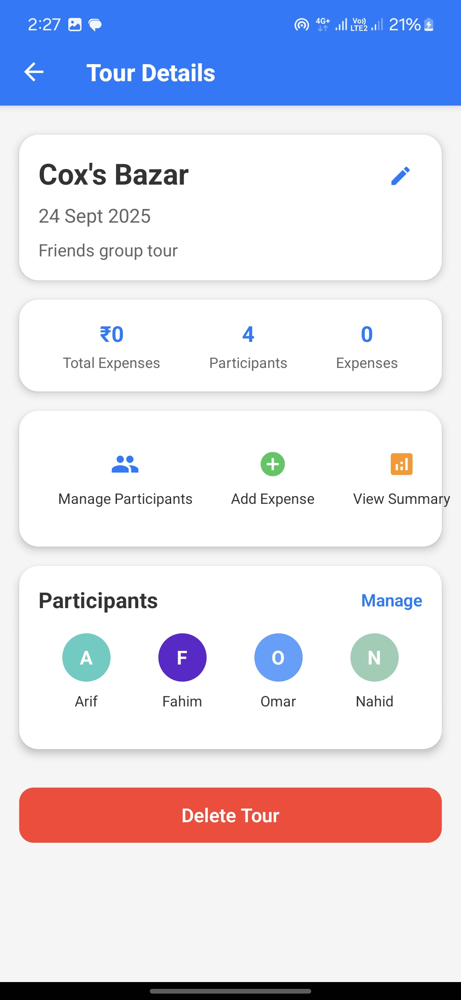
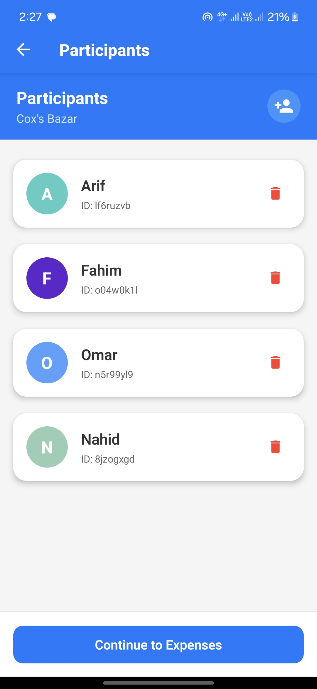
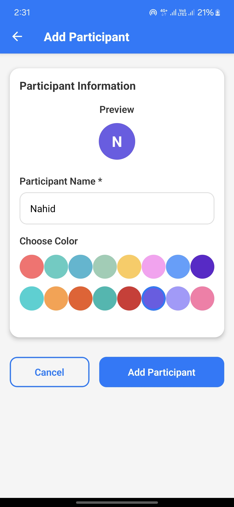
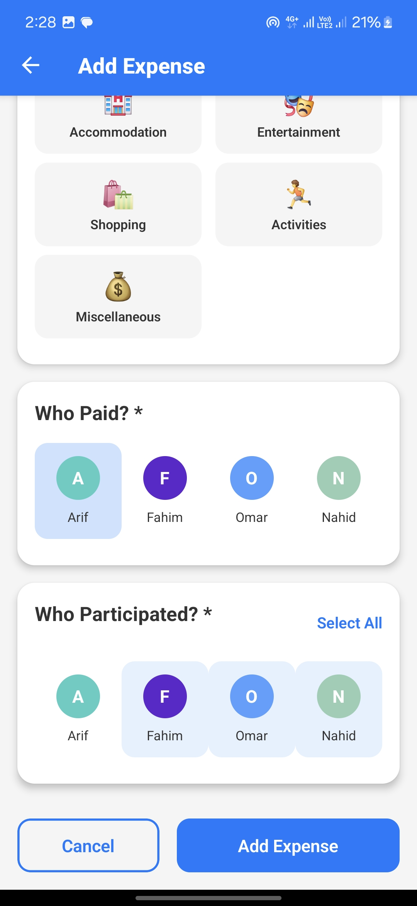
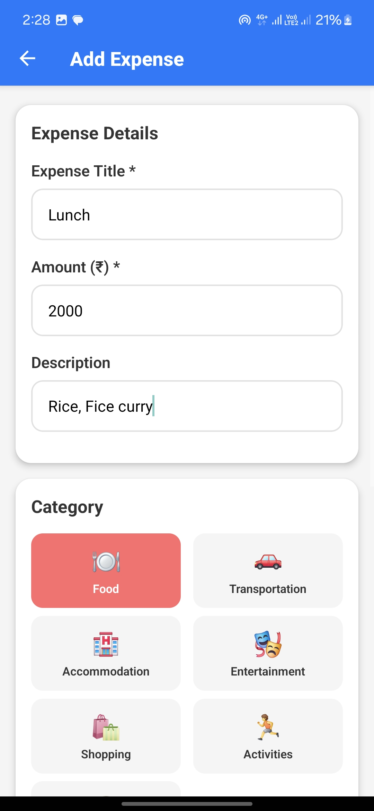

# 🧳 TourExpense - Group Tour Expense Tracker

<div align="center">

  
  
  
  

  **A comprehensive React Native app for tracking and splitting expenses during group tours and trips**

  *Perfect for managing shared costs with friends, family, or colleagues during travel* 🌍

</div>

---

## 📱 App Screenshots

<div align="center">
  <table>
    <tr>
      <td align="center">
        
        <br/><b>Tour Overview</b>
      </td>
      <td align="center">
        
        <br/><b>Participants Management</b>
      </td>
      <td align="center">
        
        <br/><b>Add Participants</b>
      </td>
    </tr>
    <tr>
      <td align="center">
        
        <br/><b>Add New Expense</b>
      </td>
      <td align="center">
        
        <br/><b>Expense Categories</b>
      </td>
      
    </tr>
  </table>
</div>

---

## 🌟 Key Features

### 💰 **Smart Expense Management**
- **Multi-Tour Support**: Organize expenses by different trips and tours
- **Flexible Splitting**: Track who paid what and who participated in each expense
- **7 Expense Categories**: Food, Transportation, Accommodation, Activities, Shopping, Bills, and Other
- **Real-time Calculations**: Instant balance updates and settlement suggestions

### 👥 **Participant Management**
- **Custom Avatars**: Personalized participant profiles with color coding
- **Dynamic Participation**: Flexible expense participation per transaction
- **Smart Analytics**: Individual spending patterns and balance tracking

### 📊 **Advanced Analytics**
- **Overview Dashboard**: Quick stats and visual breakdowns
- **Settlement Optimization**: Minimize transaction count with smart algorithms
- **Expense History**: Detailed transaction logs with filtering options
- **Balance Tracking**: Real-time who-owes-what calculations

### 🎨 **Premium User Experience**
- **Material Design UI**: Modern interface with cards, shadows, and smooth animations
- **Offline-First**: All data stored locally with AsyncStorage
- **Type-Safe**: Built with TypeScript for reliability
- **Responsive Design**: Optimized for all screen sizes

---

## 🚀 Quick Start

### Prerequisites
- **Node.js** >= 20
- **React Native CLI** or **Expo CLI**
- **Android Studio** (for Android development)
- **Xcode** (for iOS development on macOS)

### Installation

```bash
# Clone the repository
git clone https://github.com/your-username/TourExpense-ReactNative.git
cd TourExpense-ReactNative

# Install dependencies
npm install

# For iOS (macOS only)
cd ios && pod install && cd ..

# Start Metro bundler
npm start

# Run on device/emulator
npm run android  # For Android
npm run ios      # For iOS
```

---

## 🏗️ Tech Stack & Architecture

<div align="center">

| Technology | Purpose | Version |
|------------|---------|---------|
| **React Native** | Cross-platform mobile framework | 0.81.1 |
| **TypeScript** | Type safety and developer experience | ^5.8.3 |
| **React Navigation 7** | Navigation system | ^7.x |
| **AsyncStorage** | Local data persistence | ^2.2.0 |
| **Vector Icons** | Material Design icons | ^10.3.0 |
| **React Context** | State management | Built-in |

</div>

### 📁 Project Structure
```
src/
├── 🧩 components/          # Reusable UI components
│   ├── Avatar.tsx          # Custom avatar component
│   ├── Button.tsx          # Styled button component
│   ├── Card.tsx            # Material card container
│   └── Input.tsx           # Enhanced text input
├── 🎯 context/             # State management
│   └── AppContext.tsx      # Global app state & actions
├── 🧭 navigation/          # Navigation configuration
│   └── AppNavigator.tsx    # Stack & tab navigators
├── 📱 screens/             # Screen components
│   ├── ToursListScreen.tsx      # Main tours overview
│   ├── CreateTourScreen.tsx     # New tour creation
│   ├── TourDetailsScreen.tsx    # Tour dashboard
│   ├── ParticipantsScreen.tsx   # Manage participants
│   ├── AddExpenseScreen.tsx     # Add/edit expenses
│   └── ExpenseSummaryScreen.tsx # Analytics & insights
├── 📋 types/               # TypeScript definitions
└── 🔧 utils/               # Helper functions & calculations
```

---

## 💡 How It Works

### 🧮 **Smart Settlement Algorithm**
1. **Track Contributions**: Records who paid for each expense
2. **Calculate Shares**: Determines each person's fair share based on participation
3. **Optimize Settlements**: Minimizes the number of required transactions
4. **Generate Instructions**: Provides clear step-by-step payment guidance

### 💾 **Data Flow**
- **Local-First**: All data stored securely on device using AsyncStorage
- **Instant Sync**: Changes reflect immediately across all screens
- **Type Safety**: TypeScript ensures data integrity throughout the app
- **Context Pattern**: Centralized state management with React Context + useReducer

---

## 🎯 Usage Guide

### 1. **Create Your Tour** 🗺️
Start by setting up a new tour with title, dates, and description

### 2. **Add Participants** 👥
Invite friends and assign each person a unique color and avatar

### 3. **Track Expenses** 💸
Log expenses with details about:
- Who paid the bill
- Who participated in the expense
- Category and amount
- Date and description

### 4. **View Analytics** 📈
Check comprehensive summaries including:
- Total spending and averages
- Individual balances (who owes what)
- Optimized settlement recommendations
- Category-wise breakdowns

---

## 🔧 Development

### Available Scripts
```bash
npm start      # Start Metro bundler
npm run android # Run on Android device/emulator
npm run ios     # Run on iOS device/simulator
npm run lint    # Run ESLint code analysis
npm test       # Execute test suite
```

### Code Quality
- ✅ **TypeScript** for type safety and IntelliSense
- ✅ **ESLint** for consistent code style
- ✅ **Prettier** for automatic code formatting
- ✅ **Jest** for unit testing

---

## 🔮 Upcoming Features

- [ ] 🌐 **Cloud Sync**: Backup and sync across devices
- [ ] 📄 **Export Options**: PDF receipts and CSV reports
- [ ] 📸 **Receipt Scanner**: OCR for automatic expense entry
- [ ] 💱 **Multi-Currency**: Support for different currencies with live rates
- [ ] 🔔 **Smart Notifications**: Expense reminders and settlement alerts
- [ ] 💳 **Payment Integration**: Direct payments through popular apps
- [ ] 📊 **Advanced Analytics**: Spending trends and budget insights
- [ ] 🎨 **Themes**: Dark mode and custom color schemes

---

## 🤝 Contributing

We welcome contributions! Here's how to get started:

1. **Fork** the repository
2. **Create** a feature branch (`git checkout -b feature/amazing-feature`)
3. **Make** your changes with proper TypeScript types
4. **Test** your changes (`npm test && npm run lint`)
5. **Commit** your changes (`git commit -m 'Add amazing feature'`)
6. **Push** to your branch (`git push origin feature/amazing-feature`)
7. **Open** a Pull Request

---

## 📄 License

This project is licensed under the **MIT License** - see the [LICENSE](LICENSE) file for details.

---

## 🆘 Support

Need help? We're here for you!

- 🐛 **Bug Reports**: [Open an issue](https://github.com/your-username/TourExpense-ReactNative/issues)
- 💡 **Feature Requests**: [Start a discussion](https://github.com/your-username/TourExpense-ReactNative/discussions)
- 📖 **Documentation**: Check our [Wiki](https://github.com/your-username/TourExpense-ReactNative/wiki)
- ⚙️ **Setup Issues**: Review [React Native Environment Setup](https://reactnative.dev/docs/environment-setup)

---

<div align="center">

## ⭐ Star this repository if it helped you manage your group expenses better!

**Built with ❤️ using React Native, TypeScript, and lots of ☕**

*Happy Travels! 🌟*

</div>